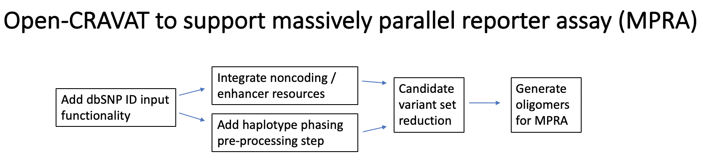

# Ultrafast_Variant_Ranking
Ultrafast Variant Ranking for Cancer and Beyond!

Goal: To enhance the annotation of noncoding variation in support of massively parallel reporter assays (MPRAs), including the generation of oligomer sequences. 

## Goals 
  
* Support variant input via dbSNP identifiers (rsids)
* Enable haplotype phasing as an optional pre-processing step
* Oligomer generation module 

