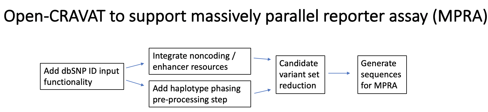

# Ultrafast_Variant_Ranking
Ultrafast Variant Ranking for Cancer and Beyond!

Our goal is to enhance the annotation of noncoding variation in support of massively parallel reporter assays, extending from initial analysis of variants to the generation of short nucleotide sequences for use in experimental design. We will do so within the previously existing Open-CRAVAT framework, designed for fast and easy annotation of genetic variation from a diverse set of tools and database resources.

## Introduction 

Open-CRAVAT is a python package that performs genomic variant interpretation. The modular and locally-installed command-line or GUI interface allows for  annoations of gene- and variant-level impact, interactions, conservation, and scoring. In this work, we advance the platform to assist in the interrogation of genetic variation via massively parallel reporter assays (MPRAs). 

MPRAs are used to validate DNA nucleotides for their regulatory roles. MPRAs are one of the functional assays used to validate cis regulatory elements for their enhancer/silencer like activity. Both MPRAs and a similar assay called STARR-seq (self-transcribing active regulatory region sequencing) use short nucleotide sequences (100-400bp) to functionaly validate regulatory variants. 

## Workflow

Presentation: https://docs.google.com/presentation/d/1XTkqG97xdkzo3g7vskjDrxHnCHOkqNEl3TbnfOMApuM/edit?usp=sharing 

## Goals 
  
* As a significant proportion of use-cases for reseach do not consist of VCF-formatting genetic variation, we will add functionality for Open-CRAVAT to allow for variant input via dbSNP identifiers (rsids). The large size of the dbSNP database will require software design. 
* For users that have utilized GATK ReadBackedPhasing to annotate their VCF file, Open-CRAVAT will automatically generate a results column describing haplotype block annotations in the initial VCF pre-processing step. A stretch goal is expand the method to incorporate other similar tools, if the output format is suitable for inclusion in the method. The remaining corpus of phasing software appears to output format that is not in VCF format, and so their support in the Open-CRAVAT framework may be subject to their use in the field. 
* Addition of a store annotators that annotate noncoding variation with known regulatory relationship. 
* A new module to generate short sequences to be used in MPRAs. Given an rsID and reference/alternate allele pair, the module will generate a pair of nucleotide sequences representing the local region of the genome (+/- 50 residues on either side of the locus). 

## Dependencies 

* Open-CRAVAT https://github.com/KarchinLab/open-cravat/wiki 
* Python 3+ https://www.python.org/download/releases/3.0/
* GATK ReadBackedPhasing https://software.broadinstitute.org/gatk/documentation/tooldocs/3.8-0/org_broadinstitute_gatk_tools_walkers_phasing_ReadBackedPhasing.php

## How to access the data

Each of these new resources wil be made freely available in the Open-CRAVAT store. The haplotype phasing is incorporated into the  in the following titles: vcf-converter (haplotypes), dbsnp-converter (dbsnp IDs), VISTA Enhancer Browser annotator (VISTA data), and Javierre regulatory variant annotator (Javierre et al.). After installation of the above listed converters and annotators, inclusion of these modules with job processing will add the data to the results table. 

## Resources utilized

* Promoter capture hic processed data for 17 human primary blood cell types DOI:https://doi.org/10.1016/j.cell.2016.09.037
* Visel, A., Minovitsky, S., Dubchak, I., & Pennacchio, L. A. (2006). VISTA Enhancer Browser—a database of tissue-specific human enhancers. Nucleic acids research, 35(suppl_1), D88-D92. https://enhancer.lbl.gov/
* Javierre, B. M., Burren, O. S., Wilder, S. P., Kreuzhuber, R., Hill, S. M., Sewitz, S., ... & Burden, F. (2016). Lineage-specific genome architecture links enhancers and non-coding disease variants to target gene promoters. Cell, 167(5), 1369-1384. 

## Participants

Kymberleigh Pagel, Johns Hopkins University, Baltimore MD, kpagel1@jhu.edu  
Kyle Moad, In Silico Solutions, Falls Church VA, kmoad@insilico.us.com  
Mary Wood, Portland VA Research Foundation and Oregon Health and Science University, Portland OR, mary.a.wood.91@gmail.com  
Arpit Mishra, University of Washington, Seattle, arpitm@uw.edu  
